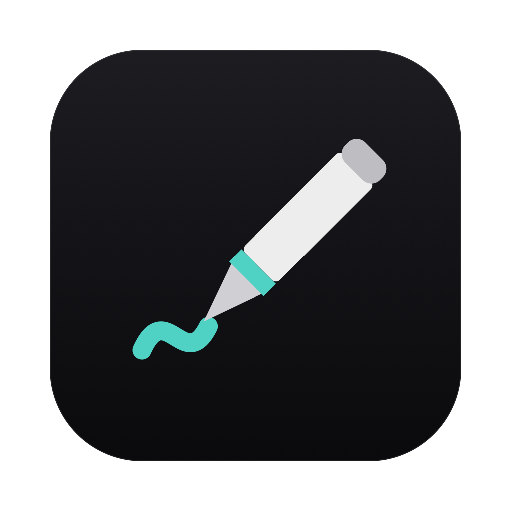
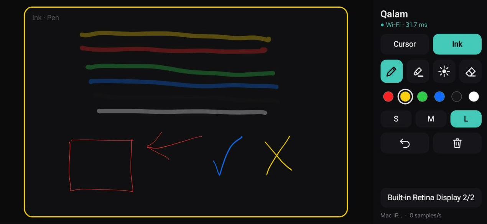
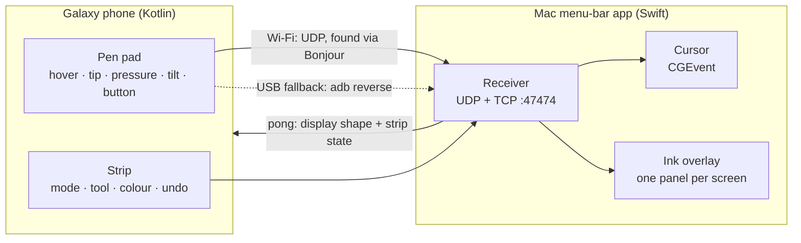

[](LICENSE)

____
<br>

<div align="center">



# Qalam

**Your phone's S Pen as a pen tablet for the Mac, and a pen that writes on your screen while you record.**

</div>

*Qalam* (قلم) is Persian for "pen". It turns a Samsung Galaxy phone with an S Pen into a
Wacom-style tablet for macOS:
- **Cursor mode:** hover to move the cursor, tap to click.
- **Ink mode:** write over anything on the screen. Circle a line of code, highlight a number,
  point with a laser. QuickTime, OBS and any other screen recorder capture it as if it were
  part of the screen.

<div align="center">




</div>

> **The premise.** You already carry a pressure-sensitive digitizer in your pocket. Qalam sends
> **only the pen** to the Mac (no screen mirroring, no video), so it stays light and fast:
> every S Pen sample, about 240 a second, a few milliseconds over Wi-Fi.

## Features

- **Cursor mode**: hovering moves the Mac cursor, the tip clicks and drags, the side button
  right-clicks, and double-clicks work. A small tap slop keeps clicks precise.
- **Ink mode**: a pen with pressure, a highlighter, a laser pointer that fades, an eraser (or
  hold the side button), 6 colours, 3 sizes, undo, clear, and optional fade-away.
- **Writes on top of everything**: a click-through overlay on every screen, including over
  full-screen apps. Your real mouse keeps working underneath, and recorders capture the ink.
- **Several monitors**: one screen at a time, or all of them as one surface. Switch from the
  phone, from the menu or with ⌃⌥D, or let the pen follow your mouse to another screen.
- **Wi-Fi first, USB as the fallback**: the phone finds the Mac by itself (Bonjour). If Wi-Fi
  drops, it switches to the USB cable (`adb reverse`) within a second, and back again later.
- **Palm rejection**: only the S Pen counts, so fingers and palms never draw.
- **Low latency by design**: unbuffered stylus input, every historical sample, Wi-Fi
  low-latency mode, and one-euro smoothing that removes jitter without adding lag.
- **Menu-bar app**: no Dock icon, global ⌃⌥ hotkeys, open at login.
- **Nothing leaves your network**: no account, no cloud, no analytics.



___

<br>
<details>
  <summary>1. Requirements</summary>

- **Mac:** macOS 15 or later, Apple Silicon or Intel. Building needs the Xcode command-line
  tools (Swift 6).
- **Phone:** a Galaxy phone or tablet with an S Pen on Android 14 or later (built and tested on
  a Galaxy S26 Ultra). Its S Pen has no Bluetooth, and Qalam doesn't need it. Building needs the
  Android SDK and a JDK 17+ (Android Studio's bundled one works).
- **USB fallback:** USB debugging on the phone, and `adb` on the Mac.

</details>

<details>
  <summary>2. Installation</summary>

```bash
git clone https://github.com/nim444/qalam.git
cd qalam

# Everything at once: builds the Mac app into /Applications, installs and opens the phone app
# on the phone attached with USB debugging, then starts Qalam.
./scripts/run.sh
```

Or one side at a time:

```bash
./scripts/build-mac-app.sh                 # → mac/build/Qalam.app (ad-hoc signed)
cp -R mac/build/Qalam.app /Applications/ && open /Applications/Qalam.app

cd android && ./gradlew assembleDebug     # → app/build/outputs/apk/debug/app-debug.apk
adb install -r app/build/outputs/apk/debug/app-debug.apk
```

**First run on the Mac:**
- **Cursor mode** needs Accessibility, because moving the cursor means posting mouse events.
  In the menu choose **Allow Accessibility…**, then turn Qalam on under System Settings →
  Privacy & Security → Accessibility.
- **Ink mode** needs no permission.
- **After every rebuild** you have to grant Accessibility again. The app is ad-hoc signed and
  macOS ties the grant to the signature.
- If the macOS firewall asks, allow incoming connections.

</details>

<details>
  <summary>3. Usage</summary>

Open Qalam on the phone. It finds the Mac by itself; if it can't (some networks block
Bonjour), tap **Mac IP…** at the bottom of the strip and type the Mac's address.

**The strip on the phone:**

| Control | What it does |
|---|---|
| ● status | the link in use (Wi-Fi or USB) and its round-trip time |
| Cursor / Ink | what the pen does |
| Pen · Highlighter · Laser · Eraser | the ink tool (choosing one switches to Ink) |
| Colours | red, yellow, green, blue, black, white |
| S · M · L | stroke size. Pen strokes also follow pressure |
| Undo · Clear | undo the last stroke, erase or clear; clear wipes all the ink |
| Display | cycles the target screen: each one, then all displays |

**With the pen:**
- **Cursor mode:** hover moves the cursor, the tip clicks or drags, the side button (while
  hovering) right-clicks.
- **Ink mode:** hovering shows a ring where the pen will land, the tip writes, and holding
  the side button while writing erases.

**Hotkeys on the Mac:**

| Keys | Action |
|---|---|
| ⌃⌥I | toggle Ink / Cursor |
| ⌃⌥Z | undo |
| ⌃⌥C | clear the ink |
| ⌃⌥L | laser pointer on / off |
| ⌃⌥D | next display |

The menu-bar menu has the same controls, plus **Fade ink away** (after 3, 5 or 10 s), **Follow
the mouse**, **Smooth the pen**, **Open at login**, and the state of Accessibility and the USB
fallback.

> **Samsung's Air command** opens when you press the S Pen button while hovering. If it gets in
> the way of right-click or the eraser, turn it off in Settings → Advanced features → S Pen.

</details>

<details>
  <summary>4. How It Works</summary>

**On the phone:**
- The pad asks Android for unbuffered stylus input (`requestUnbufferedDispatch`), so every
  digitizer sample arrives as it happens instead of once per frame.
- Each `MotionEvent` goes out with all of its historical samples. Each sample is 16 bytes:
  position, pressure, tilt, and flags for hovering, touching and the button.
- Only `TOOL_TYPE_STYLUS` reaches the pad, so fingers and palms are ignored.
- A low-latency `WifiLock` stops Wi-Fi power saving from adding 50–200 ms spikes.

**On the wire:**
- Every frame starts with an 8-byte header ([protocol](docs/protocol.md)).
- The phone pings the Mac on both links every 250 ms.
- Pen frames go over **Wi-Fi** (UDP) while it answers, and over **USB** otherwise. USB is TCP
  to the phone's own `127.0.0.1`, which `adb reverse` carries over the cable; the Mac sets that
  up by itself whenever a phone is plugged in.
- Each pong tells the phone the target screen's shape, so the pad matches it (a circle stays a
  circle), and the current tool, colour and size, so the strip shows the Mac's real state.

**On the Mac:**
- **Cursor mode** posts `CGEvent` mouse events: move, down, drag, up, and right-click. It sets
  the double-click count itself. A watchdog releases a held button if the link dies mid-drag.
- **Ink mode** draws on one borderless, click-through `NSPanel` per screen, at screen-saver
  level, on every Space and over full-screen apps.
  - Strokes are kept in global coordinates, so a stroke can cross screens in All-displays mode.
  - Pen strokes are quadratic curves through the samples, and pressure sets the width.
  - Highlighter strokes go through a transparency layer, so they don't darken where they
    overlap themselves.
  - Only the changed area is redrawn.
- **Smoothing** is a one-euro filter (Casiez et al., 2012): strong when the pen is slow, which
  removes hover jitter, and almost none when it's fast, so strokes don't lag.

Why no screen mirroring? Encoding video is what makes the other tablet apps slow (25–60 ms) and
hot. You look at the Mac, as with a screenless Wacom, and the hover ring or the cursor shows
where the pen is.

</details>

<details>
  <summary>5. Project Structure</summary>

```
├── android/                        # the phone app (Kotlin, platform SDK only)
│   └── app/src/main/kotlin/ro/soluzy/qalam/
│       ├── MainActivity.kt         # pad + strip, state from the Mac
│       ├── PadView.kt              # S Pen input → pen frames
│       ├── Link.kt                 # Wi-Fi (UDP + Bonjour) and USB (TCP) links, failover
│       ├── StripViews.kt           # strip buttons, icons, palette
│       └── Wire.kt                 # wire format
├── mac/                            # Swift package
│   └── Sources/
│       ├── QalamCore/              # wire format, receiver, displays, cursor injection, adb
│       ├── Qalam/                  # the menu-bar app: controller, ink overlay, menu, hotkeys
│       └── qalam-m0/               # command-line receiver with a latency/jitter log
├── scripts/
│   ├── run.sh                      # build + install + start everything
│   ├── build-mac-app.sh            # assemble Qalam.app
│   └── make-icon.swift             # draws assets/icon-1024.png
├── docs/
│   ├── research.md                 # prior art and what each project taught us
│   ├── design.md                   # architecture, milestones, risks
│   └── protocol.md                 # the bytes on the wire
└── LICENSE                         # Apache-2.0
```

To check a link's quality, quit the app and run the command-line receiver. It prints frames/s,
lost frames, jitter and round-trip time every 2 s:

```bash
cd mac && swift build -c release && .build/release/qalam-m0 --help
```

</details>

<details>
  <summary>6. Security and Privacy</summary>

- **Qalam keeps everything on your network.** There are no servers, no accounts and no
  analytics. Only pen samples and strip commands travel, and they go directly between the
  phone and the Mac.
- **Today's limitation:** the link isn't paired or encrypted yet. While Qalam runs, any device
  on the same network that speaks the [protocol](docs/protocol.md) could move the cursor or draw
  on the overlay. Use it on networks you trust, or over USB.
- **Coming in M2:** pairing by QR code, with every frame encrypted (ChaCha20-Poly1305). It's
  next on the roadmap.

</details>

<details>
  <summary>7. Prior Art</summary>

Qalam stands on what these projects showed (details in [docs/research.md](docs/research.md)):
- [Weylus](https://github.com/H-M-H/Weylus): tablet to computer through the browser, with screen
  mirroring
- [PenBridge](https://github.com/Eta06/PenBridge): Galaxy Tab S Pen to macOS over USB
- [pencil-probe](https://github.com/ma-syu/pencil-probe): how to post pressure-sensitive tablet
  events on macOS
- [spotdraw](https://github.com/asub927/spotdraw), [Scratchpad](https://github.com/Bisaam/Scratchpad)
  and [DrawPen](https://github.com/DmytroVasin/DrawPen): screen annotation on the Mac

What Qalam adds is the combination: the phone's S Pen as the input, plus an ink overlay made for
recording.

</details>

## Roadmap

- **M2: pairing and encryption.** Scan a QR code from the menu, encrypt every frame, and
  reconnect automatically.
- **M3: USB without developer mode.** Android Open Accessory instead of `adb reverse`.
- **M4: tablet mode.** Real pressure and tilt tablet events for drawing apps (Krita, Photoshop,
  Affinity).
- **Later:**
  - a precision region for big monitors
  - shapes and arrows
  - a map of your displays on the phone
  - signed release builds

____
<br>

[](LICENSE)
