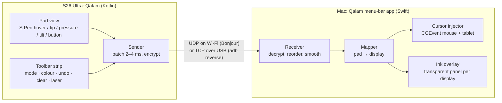

# Design (draft, 1 Oct 2026)

## Shape of the thing



The phone sends **only pen data**, never video. You look at the Mac screen; hovering shows where
the pen is.

## Modes

| Mode | Hover | Tip down | Side button | Typical use |
|---|---|---|---|---|
| **Cursor** | moves the cursor | click / drag | right-click | Driving the Mac from the couch, presenting |
| **Ink** | dot on the overlay shows the pen position; the real cursor stays put | draws on the overlay | held = temporary eraser | Writing over a screen recording |
| **Tablet** (not planned) | tablet proximity + move | pressure/tilt tablet events | right-click / configurable | Drawing apps |

Fingers never draw (palm rejection: only `TOOL_TYPE_STYLUS` reaches the pad). Fingers use the
toolbar strip.

## Phone screen layout (landscape)

```
┌───────────────────────────────────────────┬──────────┐
│                                           │  Cursor  │
│        pad: same aspect as the            │  Ink     │
│        target Mac display                 │  ● ● ● ● │
│        (~112 × 73 mm for a 14" MacBook)    │  laser   │
│                                           │  undo    │
│                                           │  clear   │
└───────────────────────────────────────────┴──────────┘
```

The Mac tells the phone the target display's aspect ratio when it connects, and the pad reshapes
to match, so a circle on the phone stays a circle on the Mac. The pad is dark and dim to save
battery, with the screen kept on and immersive mode on so Samsung edge gestures don't fire.

## Android app

- Kotlin, one Activity, Gradle wrapper, minSdk 33 / targetSdk 36.
- `PadView`:
  - calls `requestUnbufferedDispatch()` on the first event
  - reads the historical samples of every `MotionEvent`
  - handles `ACTION_HOVER_ENTER/MOVE/EXIT` and `BUTTON_STYLUS_PRIMARY`
  - reads `AXIS_PRESSURE`, `AXIS_TILT` and `AXIS_ORIENTATION`
  - a local ink echo (Jetpack Ink / front buffer) is optional, for feel
- `Sender` runs on its own thread:
  - sends the batch on a 2–4 ms tick, or straight away on down/up
  - holds `WifiLock(WIFI_MODE_FULL_LOW_LATENCY)` while the pad is open
- Discovery and pairing:
  - `NsdManager` finds the Mac's `_qalam._udp` Bonjour service
  - pairing compares a 6-digit code on both screens (see below), so the app needs no camera

## Mac app

- AppKit menu-bar app (`NSStatusItem`, no Dock icon). Target macOS 15+.
- Receiver: `NWListener` on UDP and TCP, advertising `_qalam._udp` via Bonjour. Each sample goes
  through a one-euro filter, which smooths the jitter that the ~2.7× scale-up amplifies without
  adding lag on fast strokes.
- Cursor injector: `CGEventPost` of mouse events with tablet subtypes plus the standalone
  tablet events (pattern in [research.md](research.md), finding 2). Needs the Accessibility
  permission.
- Ink overlay:
  - one borderless, transparent, non-activating `NSPanel` per display
  - level `.screenSaver`
  - `collectionBehavior = [.canJoinAllSpaces, .fullScreenAuxiliary, .stationary]`
  - `ignoresMouseEvents = true`
  - strokes are filled polygons (pressure → width), drawn on a layer-backed view; move to Metal
    only if it stutters
  - tools: pen, highlighter, laser (trail fades after about 1 s), eraser, undo, clear, and an
    optional "fade everything after N s"
- Mac hotkeys too, e.g. ⌃⌥C to clear and ⌃⌥I to toggle ink, for when the phone is out of reach.
- Display mapping: pick the target display, and the pad maps to its whole area. Later: a
  "precision region" (a smaller rectangle that follows the cursor) for fine work on a large
  monitor.

## Several monitors

Built 1 Oct 2026. The pad maps to **one display at a time**, which keeps it precise, or to
**all displays** as one surface (the bounding box of the arrangement). There are two ways to
switch:
- the display button on the phone strip cycles main → others → all → main
- **follow the mouse:** when the real mouse moves the cursor onto another display while the pen
  is away (no pen sample for 0.5 s), the pad moves there too. Our own events can't trigger
  this, because they keep the cursor on the current display. Turn it off with `--no-follow`.

On each switch the Mac releases any held button and resets the smoothing. The phone reshapes
its pad from the next pong. The display list is read again on every check, so plugging a
monitor in or out works mid-session; if the current display disappears, the main display takes
over. Later (M1 menu bar): a Mac hotkey to switch, and a small map of the display arrangement
on the phone.

## Transport: Wi-Fi first, USB as the fallback

Decided on 1 Oct 2026. The phone pings both links every 250 ms and sends pen data on **Wi-Fi**
while it answers. When Wi-Fi goes quiet for a second, pen data switches to **USB**, and it
switches back as soon as Wi-Fi answers again. USB runs through `adb reverse`, which the Mac
keeps in place for any attached phone, so plugging the cable in is all it takes. It needs
USB debugging on the phone.

## Wire protocol

Exact byte layout: [protocol.md](protocol.md).

- **v0** (M0, built): 8-byte header with a per-link counter; pen, ping and pong frames; the
  pong tells the phone the display's size. No encryption.
- **v1** (M2): AEAD with a `u64` counter as the nonce, redundant samples on UDP, and control
  messages (mode, tool, undo, clear).

**Pairing and security (built in M2):**
- **Pairing compares a 6-digit code**, like Bluetooth's numeric comparison, so the phone needs
  no camera or QR scanner. The Mac's **Pair a phone…** window opens pairing; the phone lists
  the Macs it finds.
- **The exchange:** X25519 public keys. The Mac commits to its random value before seeing the
  phone's, and both sides show a code derived from all four values. You click Pair on the Mac
  if they match.
- **Every frame afterwards** is sealed with AES-256-GCM. Keys come from the pairing key per
  connection and per direction; the counter is the nonce, and a replay window drops repeats.
- **Finding the Mac:** Bonjour carries the Mac's id, so a paired phone only talks to its own
  Mac, at whatever address it has now. If Bonjour finds nothing, it tries the last addresses
  where the Mac answered.
- **Exact bytes:** [protocol.md](protocol.md).

## Milestones

| | Goal | Done when |
|---|---|---|
| **M0** feel test (**done 1 Oct 2026**) | Pad on the phone → a Swift command-line tool (`qalam-m0`) that moves the cursor and clicks. Wi-Fi via Bonjour with USB fallback, multi-monitor, no crypto | Lag and jitter feel fine over Wi-Fi; hover works at ~2.7× and on a 3440-pt ultrawide |
| **M1** ink for recording (**built 1 Oct 2026**) | Menu-bar app with the overlay; Cursor/Ink, pen, highlighter, laser, eraser, colours, sizes, undo, clear, fade on the phone strip, the menu and ⌃⌥ hotkeys | A screen recording shows clean handwriting made on the phone |
| **M2** pairing (**built 1 Oct 2026**) | Pairing by comparing a 6-digit code (X25519 + commitment, no camera), AES-256-GCM on every frame with per-session keys and a replay window, Bonjour by Mac id, last-known-address fallback, forget on both sides | Works after a reboot or a new IP with no typing; unpaired devices are ignored |
| **M3** USB polish (*only if someone asks*) | Android Open Accessory, so USB works without debugging | The cable works on a phone with developer options off |

**Not planned (decided 1 Oct 2026):** a tablet mode with pressure/tilt events for drawing apps
(was M4), a precision region for big monitors, shapes and arrows, a map of the displays on the
phone, and an optional Mac preview on the phone.

## Risks and things to watch

- **Air command:** pressing the side button while hovering opens Samsung's Air command menu. It
  may need to be turned off in Settings → S Pen, or the button may simply not reach the app
  while hovering.
- **Hover range** is only about 10 mm. Lifting the pen further ends proximity, which is fine
  (it's how a Wacom behaves), but the cursor must not jump when the pen comes back.
- **Wi-Fi jitter:** Cursor mode always uses the newest sample. Ink mode keeps every sample, in
  order, and uses the redundancy to cover losses.
- **macOS Accessibility permission:** macOS ties it to the app's code signature, and an ad-hoc
  build loses it after every rebuild. Sign dev builds with a stable development certificate.
- **Battery / heat:** with only pen data and a dim screen it should be light; measure it.
- **Big monitors:** on a 3440 × 1440 ultrawide the whole phone maps to about 5× the distance,
  against about 2.7× on a 14" MacBook screen. If the cursor is too twitchy there, the precision
  region (later milestone) moves up.
- **macOS firewall:** if it's on, the first Wi-Fi packet makes macOS ask whether Qalam may
  accept incoming connections. It may ask again after a rebuild, because ad-hoc signatures
  change.
