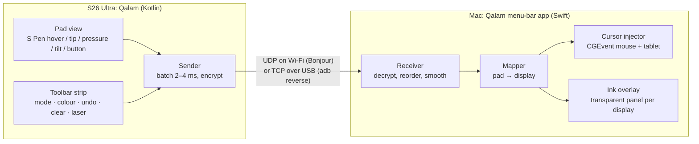

# Design (draft, 1 Oct 2026)

## Shape of the thing



The phone sends **only pen data**, never video. You look at the Mac screen; hovering shows where
the pen is.

## Modes

| Mode | Hover | Tip down | Side button | Typical use |
|---|---|---|---|---|
| **Cursor** | moves the cursor | click / drag | right-click | Driving the Mac from the couch, presenting |
| **Ink** | dot on the overlay shows the pen position; the real cursor stays put | draws on the overlay | held = temporary eraser | Writing over a screen recording |
| **Tablet** (M4) | tablet proximity + move | pressure/tilt tablet events | right-click / configurable | Drawing apps |

Fingers never draw (palm rejection: only `TOOL_TYPE_STYLUS` reaches the pad). Fingers use the
toolbar strip.

## Phone screen layout (landscape)

```
┌───────────────────────────────────────────┬──────────┐
│                                           │  Cursor  │
│        pad: same aspect as the            │  Ink     │
│        target Mac display                 │  ● ● ● ● │
│        (~112 × 73 mm on a 14" MBP)        │  laser   │
│                                           │  undo    │
│                                           │  clear   │
└───────────────────────────────────────────┴──────────┘
```

The Mac tells the phone the target display's aspect ratio when it connects, and the pad reshapes
to match, so a circle on the phone stays a circle on the Mac. The pad is dark and dim to save
battery, with the screen kept on and immersive mode on so Samsung edge gestures don't fire.

## Android app

- Kotlin, one Activity, Gradle wrapper, minSdk 33 / targetSdk 36.
- `PadView`:
  - calls `requestUnbufferedDispatch()` on the first event
  - reads the historical samples of every `MotionEvent`
  - handles `ACTION_HOVER_ENTER/MOVE/EXIT` and `BUTTON_STYLUS_PRIMARY`
  - reads `AXIS_PRESSURE`, `AXIS_TILT` and `AXIS_ORIENTATION`
  - a local ink echo (Jetpack Ink / front buffer) is optional, for feel
- `Sender` runs on its own thread:
  - sends the batch on a 2–4 ms tick, or straight away on down/up
  - holds `WifiLock(WIFI_MODE_FULL_LOW_LATENCY)` while the pad is open
- Discovery and pairing:
  - `NsdManager` finds the Mac's `_qalam._udp` Bonjour service
  - pairing is a deep link from a QR code (see below), so the app needs no camera code

## Mac app

- Swift / SwiftUI `MenuBarExtra` with no Dock icon, same family as GGTyper / Kelid. Target
  macOS 15+.
- Receiver: `NWListener` on UDP and TCP, advertising `_qalam._udp` via Bonjour. Each sample goes
  through a one-euro filter, which smooths the jitter that the ~2.7× scale-up amplifies without
  adding lag on fast strokes.
- Cursor injector: `CGEventPost` of mouse events with tablet subtypes plus the standalone
  tablet events (pattern in [research.md](research.md), finding 2). Needs the Accessibility
  permission.
- Ink overlay:
  - one borderless, transparent, non-activating `NSPanel` per display
  - level `.screenSaver`
  - `collectionBehavior = [.canJoinAllSpaces, .fullScreenAuxiliary, .stationary]`
  - `ignoresMouseEvents = true`
  - strokes are filled polygons (pressure → width), drawn on a layer-backed view; move to Metal
    only if it stutters
  - tools: pen, highlighter, laser (trail fades after about 1 s), eraser, undo, clear, and an
    optional "fade everything after N s"
- Mac hotkeys too, e.g. ⌃⌥C to clear and ⌃⌥I to toggle ink, for when the phone is out of reach.
- Display mapping: pick the target display, and the pad maps to its whole area. Later: a
  "precision region" (a smaller rectangle that follows the cursor) for fine work on a large
  monitor.

## Wire protocol (v0)

Pen packets go over UDP on Wi-Fi. Over USB they go through `adb reverse`, which carries TCP
only, so the same frames are sent length-prefixed with `TCP_NODELAY`.

```
frame   = magic "QL" (2) | version u8 | type u8 | counter u64 | AEAD(payload) | tag (16)
payload = count u8 | sample × count | previous frame's samples (redundancy, UDP only)
sample (16 bytes, little-endian):
  t_us     u32   phone clock, µs since session start
  x, y     u16   normalised to the pad, 0..65535
  pressure u16   0..65535
  tilt_x   i16   hundredths of a degree
  tilt_y   i16
  flags    u8    bit0 in-range (hover)  bit1 touching  bit2 side button  bit3 eraser
  _        u8    reserved
```

- Each frame repeats the previous frame's samples, so one lost UDP packet doesn't leave a gap in
  the ink. The receiver drops duplicates by `t_us`.
- `counter` is also the AEAD nonce and the replay guard.
- Control messages go on the same channel as a different `type`, with a small JSON body:
  `hello` (device, pad size in mm, sample rate), `display` (Mac → phone: aspect ratio and name),
  `mode`, `tool`, `undo`, `clear`, and `ping`/`pong` for measuring round-trip time and the
  clock offset.

**Pairing and security:**

- The Mac menu shows a QR code:
  `qalam://pair?id=<mac-id>&k=<32-byte key, base64url>&h=<ip>&p=<port>`.
- The Samsung camera reads QR codes natively and opens the deep link in the app.
- Both sides store the key: Android Keystore on the phone, Keychain on the Mac.
- Frames are encrypted with ChaCha20-Poly1305 (CryptoKit on the Mac; `javax.crypto` on Android 9+).
- After pairing, Bonjour finds the Mac on any network the two share. Nothing listens beyond
  the LAN, and an unpaired device can't drive the cursor.

## Milestones

| | Goal | Done when |
|---|---|---|
| **M0** feel test | Pad on the phone → UDP → a Swift command-line tool that moves the cursor and clicks. Hard-coded IP, no crypto | We know whether Wi-Fi lag and jitter feel fine, whether Air command gets in the way, and how hover feels at ~2.7× |
| **M1** ink for recording | Menu-bar app with the overlay; Ink/Cursor switch, colours, undo, clear, laser on the phone strip | A QuickTime screen recording shows clean handwriting made on the phone |
| **M2** pairing | QR pairing, Bonjour, encryption, auto-reconnect, settings (display, smoothing) | Works after a reboot or a new IP with no typing |
| **M3** USB | `adb reverse` transport, picked automatically when the cable is in | Lower, steadier lag than Wi-Fi in the latency log |
| **M4** tablet | Pressure/tilt tablet events for drawing apps | Pressure works in at least Krita and Photoshop or Affinity |
| later | Precision region, shapes/arrows, Android Open Accessory (USB without debugging), optional Mac preview on the phone | — |

## Risks / to check in M0

- **Air command:** pressing the side button while hovering opens Samsung's Air command menu. It
  may need to be turned off in Settings → S Pen, or the button may simply not reach the app
  while hovering.
- **Hover range** is only about 10 mm. Lifting the pen further ends proximity, which is fine
  (it's how a Wacom behaves), but the cursor must not jump when the pen comes back.
- **Wi-Fi jitter:** Cursor mode always uses the newest sample. Ink mode keeps every sample, in
  order, and uses the redundancy to cover losses.
- **macOS Accessibility permission:** macOS ties it to the app's code signature, and an ad-hoc
  build loses it after every rebuild. Sign dev builds with a stable development certificate.
- **Battery / heat:** with only pen data and a dim screen it should be light; measure it.
